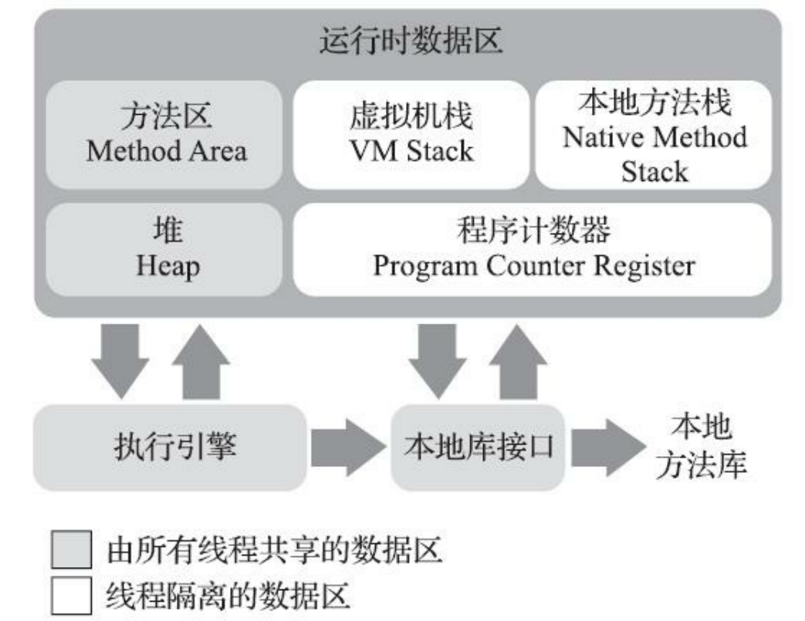

# **Java基础语法**
## **Java中length属性/length()方法/size()方法的区别**
> ### **length属性:**
> &#160; &#160; &#160; &#160; length属性是针对Java数组，求数组(不论是字符串数组还是其余类型数组)的长度可以调用X.length。
> ```java
> int[] a = new int[3];
> String[] b = new String[3]; 
> System.out.println(a.length);
> ``` 

> ### **length()方法:**
> &#160; &#160; &#160; &#160; 针对字符串类型(String,注意区分String[])，调用字符串的X.length()方法可以得到字符串的长度。
> ```java
> String a = "HelloWorld";
> System.out.println(a.length());
> ```
> 
> &#160; &#160; &#160; &#160; 注意到的是，Java中char的数组并不等于字符串，虽然String的内部机制是char数组实现的。C语言中，并没有String类，定义字符串通常使用char str[5] = "hello"的形式。String类型是Java和C#中的形式，在Java中想要将char[]转换成String类型可以使用,方法如下：
> ```java
> char[] ch = {'a','b','c'};
> String str1 = ch.toString();
> String str2 = new String(ch);
> String str3 = String.valueOf(ch);
> ```

> ### **size()方法:**
> &#160; &#160; &#160; &#160; 针对泛型集合，求泛型中元素个数。
> ```java
> List<String> list = new ArrayList<String>();
> System.out.println(list.size());
> ```
<br> 

# **Java继承关系图**
 

<br>

集合按照其存储结构可以分为两大类，分别是单列集合`java.util.Collection`和双列集合`java.util.Map`  

<br>

> **Collection**：单列集合类的<font color=#0099ff>根接口(注意与Collections集合类区别)</font>，用于存储一系列符合某种规则的元素，它有两个重要的子接口，分别是`java.util.List`和`java.util.Set`。其中，`List`的特点是元素有序、元素可重复。`Set`的特点是元素无序，而且不可重复。`List`接口的主要实现类有`java.util.ArrayList`和`java.util.LinkedList`，`Set`接口的主要实现类有`java.util.HashSet`和`java.util.TreeSet`。 
> 
> * **Collection 通用方法**
>  
> &#160; &#160; &#160; &#160; &#160; &#160; `public boolean add(E e)`：  把给定的对象添加到当前集合中 。
> 
> &#160; &#160; &#160; &#160; &#160; &#160; `public void clear()` :清空集合中所有的元素。
> 
> &#160; &#160; &#160; &#160; &#160; &#160; `public boolean remove(E e)`: 把给定的对象在当前集合中删除。
> 
> &#160; &#160; &#160; &#160; &#160; &#160; `public boolean contains(E e)`: 判断当前集合中是否包含给定的对象。
> 
> &#160; &#160; &#160; &#160; &#160; &#160; `public boolean isEmpty()`: 判断当前集合是否为空。
> 
> &#160; &#160; &#160; &#160; &#160; &#160; `public int size()`: 返回集合中元素的个数。
> 
> &#160; &#160; &#160; &#160; &#160; &#160; `public Object[] toArray()`: 把集合中的元素，存储到数组中。
> 
> * **List 特有方法**
>
> &#160; &#160; &#160; &#160; &#160; &#160; `public void add(int index, E element)`: 将指定的元素，添加到该集合中的指定位置上。
> 
> &#160; &#160; &#160; &#160; &#160; &#160; `public E get(int index)`:返回集合中指定位置的元素。
> 
> &#160; &#160; &#160; &#160; &#160; &#160; `public E remove(int index)`: 移除列表中指定位置的元素, 返回的是被移除的元素。
> 
> &#160; &#160; &#160; &#160; &#160; &#160; `public E set(int index, E element)`:用指定元素替换集合中指定位置的元素,返回值的更新前的元素。
> 
> * **List 子类**
>
> 1. **ArrayList**：其实就是数组，容量大，增删慢，查找快
> 2. **LinkedList**：增加了push/pop操作，对首尾操作提供add/get/remove+First/Last函数( 例如`addFirst(E e)` )
> 3. **Vector**：历史遗留产物，同步版的ArrayList，代码和ArrayList太像
> 4. **Stack**：继承自Vector。Java里其实没有纯粹的Stack，可以自己实现，用组合的方式，封装一下LinkedList即可
> 5. **Queue**：本来是单独的一类，不过在SUN的JDK里就是用LinkedList来提供这个功能的，主要方法是offer/pull/peek，因此归到这里 
> 
> &#160; &#160; &#160; &#160;&#160; &#160;Java中Queue有一些常用的方法：offer/add、poll/remove、peek/element
> 
> &#160; &#160; &#160; &#160;&#160; &#160;每一行中的两个函数，实现的功能是一样的，但也有所不同。
> 
> &#160; &#160; &#160; &#160;&#160; &#160;**offer，add** 区别：
> 一些队列有大小限制，因此如果想在一个满的队列中加入一个新项，多出的项就会被拒绝。这时新的 offer 方法就可以起作用了。它不是对调用 add() 方法抛出一个 unchecked 异常，而只是得到由 offer() 返回的 false。 
>
> &#160; &#160; &#160; &#160;&#160; &#160;**poll，remove**区别：
> remove() 和 poll() 方法都是从队列中删除第一个元素。remove() 的行为与 Collection 接口的版本相似，但是新的 poll() 方法在用空集合调用时不是抛出异常，只是返回 null。因此新的方法更适合容易出现异常条件的情况。
>
> &#160; &#160; &#160; &#160;&#160; &#160;**peek，element**区别：
> element() 和 peek() 用于在队列的头部查询元素。与 remove() 方法类似，在队列为空时， element() 抛出一个异常，而 peek() 返回 null
> * **Set子类：add/remove**
> 1. HashSet：内部采用HashMap实现
> 2. LinkedHashSet：采用LinkedHashMap实现
> 3. TreeSet：TreeMap。
>
> **Collections:** 集合类的一个工具类/帮助类，其中提供了一系列静态方法，用于对集合中元素进行排序、搜索以及线程安全等各种操作。
>
> * **Collections 常用方法**
> 
> &#160; &#160; &#160; &#160; &#160; &#160; `public static <T> boolean addAll(Collection<T> c, T... elements)  `:往集合中添加一些元素。
> 
> &#160; &#160; &#160; &#160; &#160; &#160; `public static void shuffle(List<?> list) `:打乱集合顺序。
> 
> &#160; &#160; &#160; &#160; &#160; &#160; `public static <T> void sort(List<T> list)`:将集合中元素按照默认规则排序。
> 
> &#160; &#160; &#160; &#160; &#160; &#160; `public static <T> void sort(List<T> list，Comparator<? super T> )`:将集合中元素按照指定规则排序。

> **Map子类**
> 1. HashMap/HashTable：散列表，和ArrayList一样采用数组实现，超过初始容量会对性能有损耗；
> 2. LinkedHashMap：继承自HashMap，但通过重写嵌套类HashMap.Entry实现了链表结构，同样有容量的问题；
> 3. Properties：是继承的HashTable。 
> 
> * **Map 常用方法**
> 
> &#160; &#160; &#160; &#160; &#160; &#160; `public V put(K key, V value)`:  把指定的键与指定的值添加到Map集合中。
> 
> &#160; &#160; &#160; &#160; &#160; &#160; `public V remove(Object key)`: 把指定的键 所对应的键值对元素 在Map集合中删除，返回被删除元素的值。
> 
> &#160; &#160; &#160; &#160; &#160; &#160; `public V get(Object key)` 根据指定的键，在Map集合中获取对应的值。
> 
> &#160; &#160; &#160; &#160; &#160; &#160; `boolean containsKey(Object key)  ` 判断集合中是否包含指定的键。
> 
> &#160; &#160; &#160; &#160; &#160; &#160; `public Set<K> keySet()`: 获取Map集合中所有的键，存储到Set集合中。
> 
> &#160; &#160; &#160; &#160; &#160; &#160; `public Set<Map.Entry<K,V>> entrySet()`: 获取到Map集合中所有的键值对对象的集合(Set集合)。

<br>

# **多线程**
 
 

<br>

# **JVM虚拟机**

<br> 
<br>
> &#160; &#160; &#160; &#160; 由于Java虚拟机的多线程是通过线程轮流切换、分配处理器执行时间的方式来实现的，在任何一个确定的时刻，一个处理器（对于多核处理器来说是一个内核）都只会执行一条线程中的指令。因此，为了线程切换后能恢复到正确的执行位置，每条线程都需要有一个独立的程序计数器，各条线程之间计数器互不影响，独立存储，我们称这类内存区域为“线程私有”的内存。
> 
> &#160; &#160; &#160; &#160; 如果线程正在执行的是一个Java方法，这个计数器记录的是正在执行的虚拟机字节码指令的地址；如果正在执行的是本地（Native）方法，这个计数器值则应为空（Undefined）。此内存区域是唯一一个在《Java虚拟机规范》中没有规定任何OutOfMemoryError情况的区域。
<br>

## **Lambda表达式**
Lambda表达式由三部分组成，用来优化代码结构  
1. 参数: (参数)
2. 箭头: ->  
3. 代码： {代码}  

凡是根据上下文能推导出来的内容都可以在Lambda表达式内省略
1. 括号中参数列表的数据类型可以省略
2. 括号中参数只有一个，那么类型和()都可以省略
3. 如果{}中代码只有一行，无论是否有返回值，都可以省略{}、return和;不写，但是三者需要同时省略

Lambda表达式使用前提：
1. 必须有接口且接口中有且只有一个抽象方法
2. 必须有上下文推断
```java
//无参无返回
NoReturnNoParam noReturnNoParam = () -> {
    System.out.println("NoReturnNoParam");
};
noReturnNoParam.method();

//一个参数无返回
NoReturnOneParam noReturnOneParam = (int a) -> {
    System.out.println("NoReturnOneParam param:" + a);
};
noReturnOneParam.method(6);

//多个参数无返回
NoReturnMultiParam noReturnMultiParam = (int a, int b) -> {
    System.out.println("NoReturnMultiParam param:" + "{" + a +"," + + b +"}");
};
noReturnMultiParam.method(6, 8);

//无参有返回值
ReturnNoParam returnNoParam = () -> {
    System.out.print("ReturnNoParam");
    return 1;
};

int res = returnNoParam.method();
System.out.println("return:" + res);

//一个参数有返回值
ReturnOneParam returnOneParam = (int a) -> {
    System.out.println("ReturnOneParam param:" + a);
    return 1;
};

int res2 = returnOneParam.method(6);
System.out.println("return:" + res2);

//多个参数有返回值
ReturnMultiParam returnMultiParam = (int a, int b) -> {
    System.out.println("ReturnMultiParam param:" + "{" + a + "," + b +"}");
    return 1;
};

int res3 = returnMultiParam.method(6, 8);
System.out.println("return:" + res3); 
```

