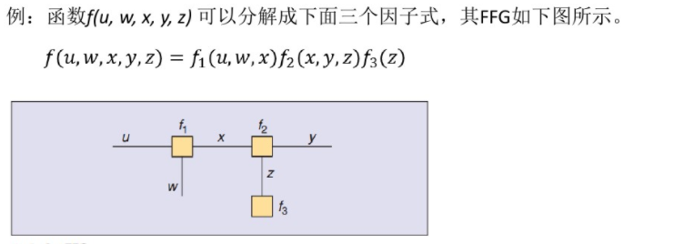
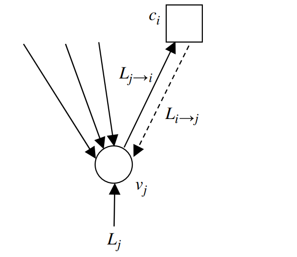
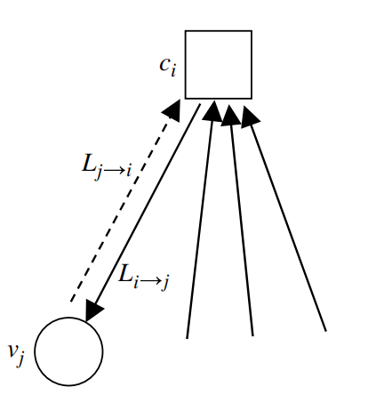
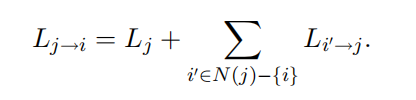
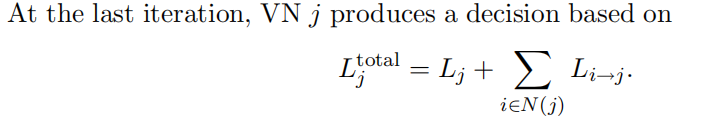

## 因子图 factor graph

### 概念：概率图的一种，对因式分解的图形表示，一般含有两种节点（变量节点和函数节点）   目的：将全局函数分解成多个局部函数的积

### 分类：
&nbsp;FFG (Forney-style factor graph)
 
&nbsp; FFG定义规则：
&nbsp; 每个因子对应唯一的节点; 
&nbsp; 每个变量对应唯一边缘或者半边缘; 
&nbsp; 代表因子g的节点与代表变量x的边缘相连，当且仅当g是关于x的函数

### sum-product algorithm(SPA)
SPA有时被叫做BPA (belief-propagation algorithm)，具体算法《Channel Codes_ Classical and Modern》中有提及。
**
LDPC的SPA算法
**

VN：变量节点

CN：校验节点

信道传输软信息LLR到变量节点，变量节点与校验节点的交互如下：

 
 
 
 
## ALOHA协议
数据链路层协议的一种
#### 纯ALOHA协议
&nbsp; 当传输点有数据需要传送的时候，它会立即向通讯频道传送。 
&nbsp; 接收点在收到数据后，会ACK(确认字符)传输点。如果接收的数据有错误，接收点会向传输点发送NACK。 
&nbsp; 当网络上的两个传输点同时向频道传输数据的时候，会发生冲突，这种情况下，两个点都停止一段时间后，再次尝试传送。
#### 分段（或时隙）ALOHA协议
&nbsp; 这是对纯ALOHA协议的一个改进，思想是用时钟来统一用户的数据发送。改进之处在于，它把频道在时间上分段，每个传输点只能在一个分段的开始处进行传送。用户每次必须等到下一个时间片才能开始发送数据，每次传送的数据必须少于或者等于一个频道的一个时间分段。这样很大的减少了传输频道的冲突。从而避免了用户发送数据的随意性，减少了数据产生冲突的可能性，提高了信道的利用率。

## 非正交多址(NOMA)
主动引入干扰，在接收端通过串行干扰删除(SIC)进行正确解调。
大概意思就是先解调功率大的信息，把功率小的信息当成干扰，然后在解调功率小的信息的时候也要先把大功率信息解调出来，然后在信息中去除大功率信息，在剩余的信息中解调出需要的小功率信息。